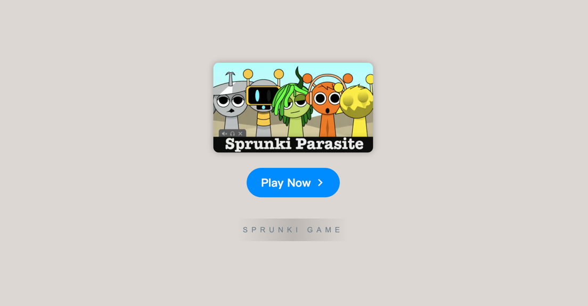

# Sprunki Parasite

    

Explore the **[Sprunki Parasite Mod](https://sprunkionline.com/parasite)**, a fan-driven twist that infuses the beloved music-mixing experience of Incredibox with a dark, parasitic theme. Known as **Parasprunki**, this mod brings eerie aesthetics, unique sounds, and a haunting atmosphere to the Sprunki universe, creating an immersive experience that takes music creation to thrilling new depths.

### Table of Contents
- Introduction
- Key Features
- How to Play
- Other Popular Mods
- Tips & Tricks
- Additional Resources

### Introduction

**[Sprunki Parasite Mod](https://sprunkionline.com/parasite)** reimagines the traditional Incredibox-style gameplay with a sinister, parasitic twist. Characters and sounds are transformed, presenting players with a darker musical experience filled with haunting visuals and unsettling rhythms. Perfect for fans of experimental and atmospheric music, Parasprunki offers a truly unique twist on the Sprunki gameplay, adding new dimensions to each composition.

### Key Features

| Feature                   | Description                                                                                   |
|---------------------------|-----------------------------------------------------------------------------------------------|
| **Dark Visual Themes**    | Characters adopt an eerie, transformed look that complements the parasitic theme.             |
| **Unique Soundscapes**    | Custom sounds blend distorted tones with ominous melodies, creating a haunting musical vibe.  |
| **Special Bonuses**       | Unlock special effects by experimenting with certain sound combinations, enhancing the dark theme. |
| **Atmospheric Gameplay**  | Build compositions that are immersive and chilling, perfect for fans of darker aesthetics.    |

### How to Play

Get started with the **Sprunki Parasite Mod** by following these steps:

1. **Choose Sounds**: Select from Parasprunki-specific sound elements to create your track.
2. **Layer for Effect**: Combine sounds to build disturbing rhythms and atmospheric melodies.
3. **Unlock Bonuses**: Experiment with sound combinations to access hidden features and effects.

### Other Popular Mods

For a comprehensive experience, explore other fan-favorite mods:

- **[Sprunki Phase 6](https://sprunkionline.com/phase/6)**: Expands the game with advanced, eerie sound elements.
- **[Sprunki Doors](https://sprunkionline.com/doors)**: A mod adding suspense-filled interactions, perfect for atmospheric compositions.
- **[Interactive Simon](https://sprunkionline.com/interactive-simon)**: Combine sounds and gameplay for a collaborative experience.

### Tips & Tricks

- **Try New Combinations**: Experiment with different sound elements to uncover hidden effects.
- **Engage with Community**: Share your creations and gather feedback for inspiration.
- **Watch Tutorials**: Gain insight into mod usage through community tutorials.

### Additional Resources

Stay updated with new mods and phases:

- [Sprunki Phase](https://sprunkionline.com/category/sprunki-phase)
- [Sprunki Retake](https://sprunkionline.com/retake)

Enjoy your journey into the eerie, musical world of **Sprunki Parasite**!
